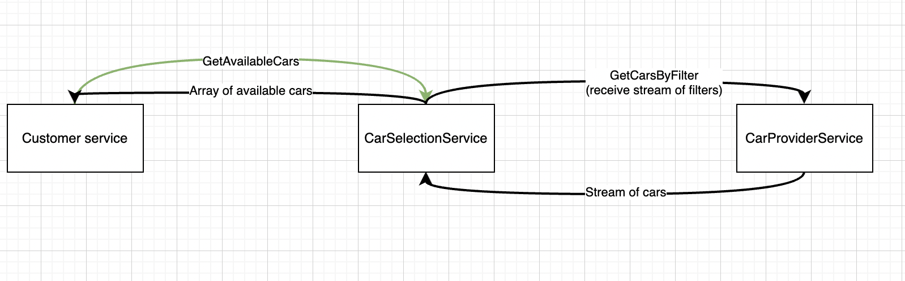

# Cars market

This is a simple application to work with gRPC.

### How it works:



There is a `customer` service, which makes gRPC request to `car-selection` service to get all the available cars.
To trigger this request HTTP `POST` request should be made to `customer` service:
```shell
curl --location --request POST 'http://localhost:36452/cars/available'
```

**NOTE:** this request receives `CarFilter` object (this request body is optional, because logic for cars filtering was not implemented).

In this case `car-selection` service returns `GetAvailableCarsResponse` object, which has array of cars:
```protobuf
repeated Car car = 1;
```

There is a special logic for `car-selection` service to find new cars. To trigger this logic HTTP `POST` request should be made:
```shell
curl --location --request POST 'http://localhost:33643/cars/find-new'
```
**NOTE:** this request receives `CarFilter` object (this request body is optional, because logic for cars filtering was not implemented).

This will trigger gRPC request from `car-selection` service to the `car-provider` service. 
In this case `car-provider` returns stream of `Car`s:
```protobuf
 rpc findCarsByFilter(CarFilter) returns (stream Car);
```

### How to start the project:
To start the project you have to 
* execute `mvn clean install` in the parent directory
* execute `mvn spring-boot:run` in a folder of each of the services (car-provider, car-selection, customer)